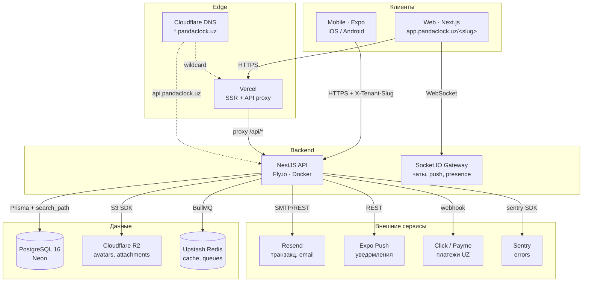
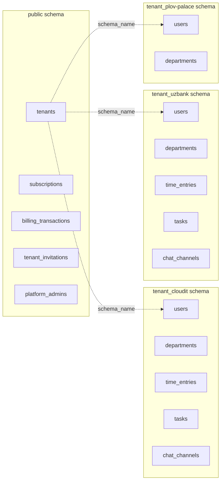
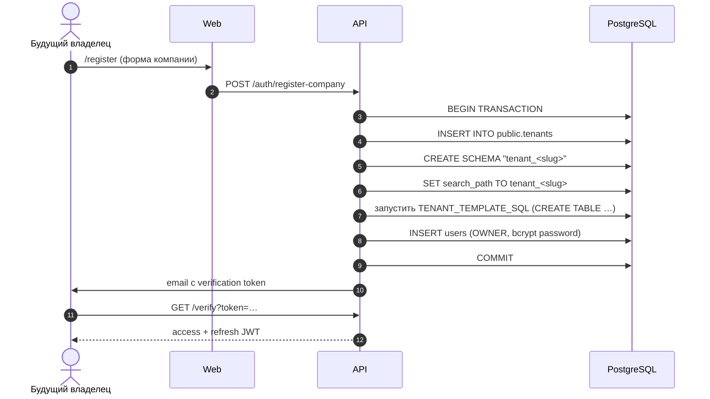
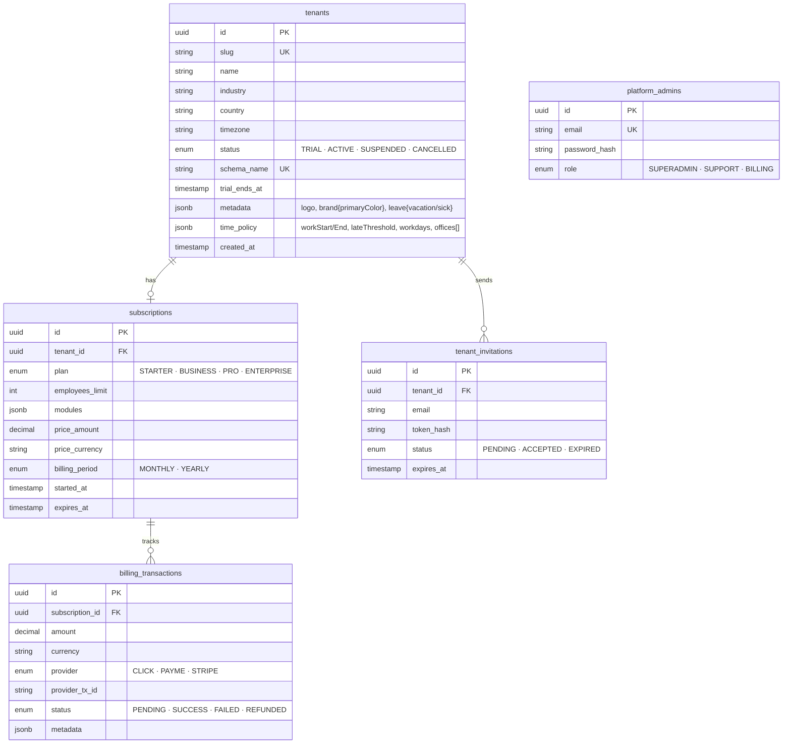
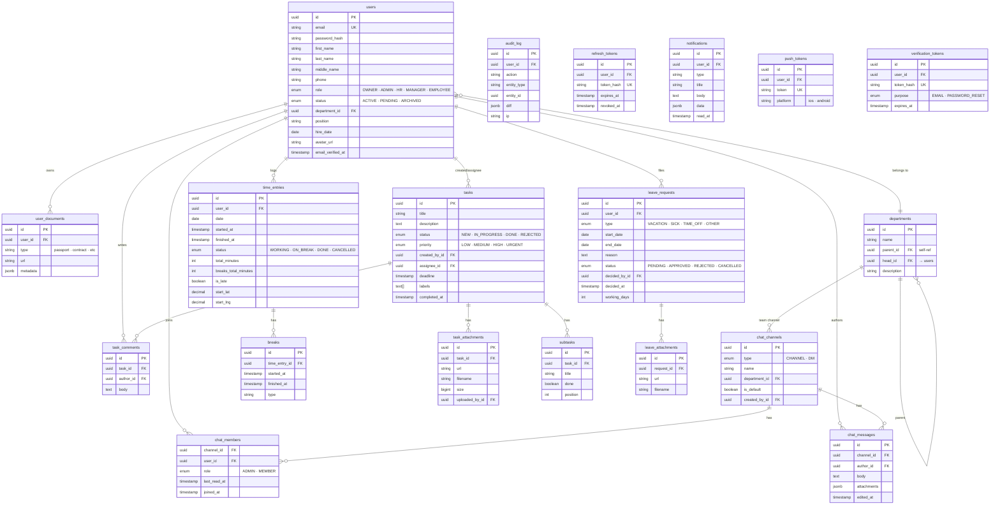
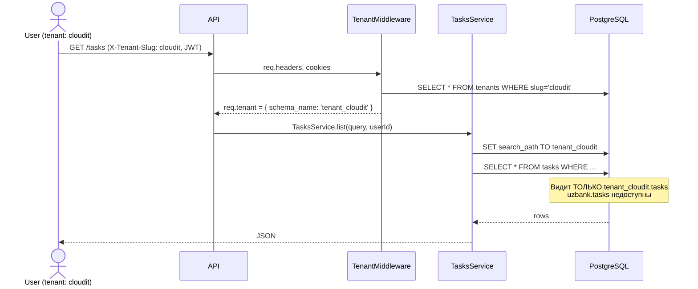

# Pandaclock — Технический паспорт

> Архитектура, диаграммы и структура данных проекта.
> Документ можно скинуть преподавателю / комиссии в виде Markdown
> (рендерится в GitHub, Notion, Obsidian) или экспортировать в PDF.

---

## Оглавление

1. [Стек технологий](#1-стек-технологий)
2. [Архитектура системы](#2-архитектура-системы)
3. [Multi-tenancy](#3-multi-tenancy-один-postgres-много-tenants)
4. [Диаграмма классов (модули API)](#4-диаграмма-классов-модули-api)
5. [Структура БД](#5-структура-бд)
   - 5.1 [Public schema (платформа)](#51-public-schema-платформа)
   - 5.2 [Tenant schema (данные компании)](#52-tenant-schema-данные-компании)
6. [Безопасность и роли](#6-безопасность-и-роли)
7. [Структура репозитория](#7-структура-репозитория)

---

## 1. Стек технологий

| Слой               | Технология                                      | Версия |
| ------------------ | ----------------------------------------------- | ------ |
| **Web frontend**   | Next.js 15 (App Router) + React 19 + TypeScript | 15.x   |
| **Mobile**         | Expo SDK 52 + React Native + expo-router        | 52.x   |
| **API**            | NestJS 11 + Node 22                             | 11.x   |
| **БД**             | PostgreSQL 16 (Neon в проде)                    | 16     |
| **ORM**            | Prisma 6 (для public) + raw SQL (для tenant)    | 6.x    |
| **Realtime**       | Socket.IO (чаты, push событий)                  | 4.x    |
| **Storage**        | Cloudflare R2 / MinIO (S3 API)                  | —      |
| **Кэш / очередь**  | Upstash Redis (план: BullMQ)                    | 7.x    |
| **Email**          | Resend                                          | —      |
| **Auth**           | JWT (access 15 мин + refresh 30 дней) + bcrypt  | —      |
| **UI lib**         | shadcn/ui + Tailwind CSS + Radix primitives     | —      |
| **Mobile UI**      | NativeWind (Tailwind для RN)                    | —      |
| **Monorepo**       | pnpm workspaces + Turbo                         | —      |
| **CI/CD**          | GitHub Actions → Vercel (web) + Fly.io (api)    | —      |
| **Push**           | Expo Push Notifications                         | —      |
| **Платежи**        | Click, Payme (UZ) + Stripe (заготовка)          | —      |
| **Тесты**          | Vitest (74 теста)                               | —      |
| **Error tracking** | Sentry                                          | —      |

---

## 2. Архитектура системы

Pandaclock — это **SaaS HR/Time-tracking** для Узбекистана с **multi-tenant** архитектурой («одна схема БД на компанию»).



**Ключевые идеи:**

- **Tenant isolation** через PostgreSQL `search_path` — каждая компания живёт в отдельной схеме (`tenant_acmebank`, `tenant_uzbank` …).
- **Web** проксирует запросы к API через Next.js API routes — JWT в HttpOnly-cookie никогда не уходит в браузер.
- **Realtime** — отдельный Socket.IO gateway внутри NestJS, с tenant-aware rooms (`tenant:{slug}:channel:{id}`).
- **Storage** — R2 совместим с S3 API, дешевле (нет egress). Локально заменяется MinIO.

---

## 3. Multi-tenancy (один Postgres, много tenants)



**Жизненный цикл tenant'а:**



**Каждый запрос** проходит через `TenantMiddleware`:

```ts
extractTenantSlug(req) // 1. X-Tenant-Slug header
                       // 2. cookie pcl_tenant
                       // 3. ?tenant=… query
                       // 4. subdomain <slug>.pandaclock.uz
SELECT id, schema_name FROM tenants WHERE slug = ?
req.tenant = tenant  // дальше TenantPrismaService использует schema_name
```

---

## 4. Диаграмма классов (модули API)

NestJS API организован по **feature-модулям**. Каждый модуль = `Controller + Service(s) + DTO`.

```mermaid
classDiagram
    class TenantMiddleware {
        +use(req, res, next) Promise~void~
        -extractTenantSlug(req) string
    }

    class TenantPrismaService {
        -prismaPerSchema: Map
        +getClient() Promise~PrismaClient~
        +setSearchPath(schema)
    }

    class AuthService {
        +login(email, password) Tokens
        +refresh(refreshToken) Tokens
        +verifyEmail(token)
        +requestPasswordReset(email)
        +resetPassword(token, password)
    }

    class TenantService {
        +createTenant(params) Tenant
        +getProfile(slug) TenantProfile
        +updateProfile(slug, input)
        +getPolicy(slug) TimePolicy
        +updatePolicy(slug, input)
    }

    class EmployeesService {
        +list(query) Page~Employee~
        +invite(emails) Outcome
        +update(id, dto)
        +remove(id)
    }
    class ExcelImportService {
        +importFromBuffer(buffer) Outcome
        +parseBuffer(buffer) Entries
    }

    class TasksService {
        +list(query) Page~Task~
        +getById(id) TaskDetail
        +create(dto)
        +update(id, dto)
        +listComments(taskId)
        +addComment(taskId, userId, body)
    }
    class SubtasksService {
        +list(taskId)
        +create(taskId, title)
        +update(id, dto)
        +remove(id)
    }
    class TaskAttachmentsService {
        +list(taskId)
        +upload(taskId, userId, file)
        +remove(id, userId)
    }

    class ChatsService {
        +listChannels(userId)
        +createChannel(input)
        +listMessages(channelId)
        +sendMessage(id, authorId, body, attachments)
        +listMembers(channelId)
        +addMember/removeMember(...)
    }
    class ChatUploadsService {
        +upload(tenantSlug, channelId, file)
    }
    class ChatsGateway {
        +onJoin(client, body)
        +onSend(client, body)
        +onTyping(client, body)
    }

    class TimeService {
        +getToday(userId) TodaySession
        +startDay/finishDay(userId, coords)
        +startBreak/finishBreak(userId)
    }

    class RequestsService {
        +list(query)
        +create(dto)
        +approve/reject(id, userId)
        +cancel(id, userId)
        +balance(userId) LeaveBalance
    }

    class DepartmentsService {
        +list()
        +tree()
        +create/update/remove(...)
    }

    class NotificationsService {
        +list(userId, query)
        +markRead(id, userId)
        +unreadCount(userId)
    }

    class UploadsService {
        +uploadAvatar(userId, tenant, file) AvatarUrl
    }

    class S3Client {
        <<external>>
    }

    TenantMiddleware --> TenantPrismaService : enriches request
    TenantPrismaService ..> "Postgres" : SET search_path

    AuthService --> TenantPrismaService
    EmployeesService --> TenantPrismaService
    ExcelImportService --> EmployeesService
    TasksService --> TenantPrismaService
    SubtasksService --> TenantPrismaService
    TaskAttachmentsService --> TenantPrismaService
    TaskAttachmentsService --> S3Client
    ChatsService --> TenantPrismaService
    ChatUploadsService --> S3Client
    ChatsGateway --> ChatsService
    TimeService --> TenantPrismaService
    TimeService --> TenantService : reads time_policy
    RequestsService --> TenantPrismaService
    DepartmentsService --> TenantPrismaService
    NotificationsService --> TenantPrismaService
    UploadsService --> S3Client
```

**Принципы:**

- Все сервисы зависят от `TenantPrismaService` (REQUEST-scoped), который под капотом выставляет `search_path` на схему текущего тенанта.
- DTO-классы (`class-validator`) валидируют входной payload до того, как доходит до сервиса.
- `RolesGuard` и granular `PermissionsGuard` (по `Permission` из `@pandaclock/types`) контролируют доступ.
- Socket.IO (`ChatsGateway`) реализует realtime — broadcasts в room'ы `tenant:{slug}:channel:{id}`.

---

## 5. Структура БД

### 5.1 Public schema (платформа)

Общие для всей платформы таблицы — управляются Prisma migrations.



### 5.2 Tenant schema (данные компании)

Шаблон создаётся при `CREATE SCHEMA tenant_<slug>` и заливается через `TENANT_TEMPLATE_SQL`.



---

## 6. Безопасность и роли

### Аутентификация

- **JWT access** — 15 минут, в HttpOnly-cookie у web, в SecureStore у mobile.
- **JWT refresh** — 30 дней, хранится в `tenant.refresh_tokens` (хэш).
- **Sliding session** — refresh при 401 + повторение запроса прозрачно для UI.
- **Password** — bcrypt с `BCRYPT_ROUNDS=10` (12 в проде).

### Авторизация (RBAC + granular permissions)

| Role         | Что может                                        |
| ------------ | ------------------------------------------------ |
| **OWNER**    | Всё. Платежи, тенант-настройки, удалить компанию |
| **ADMIN**    | Всё кроме `billing:manage` (оплата плана)        |
| **HR**       | Сотрудники, отделы, заявки, отчёты, audit log    |
| **MANAGER**  | Свой отдел: задачи, заявки команды, отчёты       |
| **EMPLOYEE** | Свои задачи и заявки, общие чаты                 |

Permissions определены в `packages/types/src/permissions.ts` — статичный mapping `Role → Permission[]`. Используется и в API (`@Roles` decorator + `RolesGuard`), и в web (`hasPermission()` для скрытия пунктов меню).

### Защита от утечек данных между тенантами



Даже если злоумышленник:

- подделает X-Tenant-Slug → JWT валидирует **именно cloudit** (поле `tenant` в payload), middleware сравнивает и бросает 403
- получит SQL injection в text-поле → `search_path` уже выставлен, чужая схема недоступна
- украдёт чужой JWT → `refresh_tokens.revoked_at` позволяет отозвать сессию через logout

### Дополнительно

- **CORS** — whitelist origins
- **Rate limiting** — на login + forgot-password (anti-bruteforce)
- **CSP** — strict в production
- **Audit log** — в каждой tenant-схеме фиксирует все CUD-операции с diff
- **Sentry** — error tracking с tenant-tag для фильтрации

---

## 7. Структура репозитория

```
hr-crm/
├── apps/
│   ├── api/                  ← NestJS 11 backend
│   │   └── src/
│   │       ├── auth/         ← JWT, register, forgot/reset password
│   │       ├── tenant/       ← TenantMiddleware, schema management
│   │       ├── employees/    ← CRUD сотрудников, Excel-импорт
│   │       ├── departments/  ← Иерархия отделов (drag-drop tree)
│   │       ├── tasks/        ← Задачи + comments + subtasks + attachments
│   │       ├── time/         ← Чек-ин/чек-аут, geofence, отчёты
│   │       ├── requests/     ← Отпуска / больничные с approval flow
│   │       ├── chats/        ← Каналы, DM, members, attachments, Socket.IO
│   │       ├── notifications/← In-app + Expo push
│   │       ├── billing/      ← Click/Payme webhooks, transactions
│   │       ├── reports/      ← Excel/PDF экспорт
│   │       ├── uploads/      ← Avatar S3 upload (sharp resize)
│   │       └── observability/← Sentry, logging
│   ├── web/                  ← Next.js 15 dashboard (server components)
│   │   └── src/app/
│   │       ├── api/          ← Proxy /api/* → NestJS (JWT в HttpOnly cookie)
│   │       └── dashboard/    ← Страницы: employees, tasks, time, chats…
│   ├── mobile/               ← Expo 52 mobile app
│   │   └── app/
│   │       ├── (tabs)/       ← home, tasks, chats, requests, profile
│   │       └── tasks/[id]/   ← detail с comments + attachments + subtasks
│   └── marketing/            ← Лендинг pandaclock.uz
├── packages/
│   ├── db/                   ← Prisma schema (public) + TENANT_TEMPLATE_SQL
│   │   ├── prisma/schema.prisma  ← public tables (Tenant, Subscription…)
│   │   ├── src/tenant-template.ts ← SQL для tenant-schema
│   │   ├── migrations-tenant/ ← per-tenant SQL migrations runner
│   │   └── scripts/apply-tenant-migration.ts
│   ├── ui/                   ← shadcn/ui + кастомные компоненты для web
│   ├── config/               ← Tailwind preset, ESLint config
│   └── types/                ← Shared TypeScript types + permissions matrix
├── docs/                     ← Эта документация
└── docker-compose.yml        ← Локальный Postgres + Redis + MinIO + Mailpit
```

---

## Как смотреть этот документ

| Где                    | Как                                                                                                                                      |
| ---------------------- | ---------------------------------------------------------------------------------------------------------------------------------------- |
| **GitHub**             | Просто откройте `.md` в репо — Mermaid рендерится автоматически                                                                          |
| **Notion**             | Импортируйте файл → блоки преобразуются, Mermaid в `/mermaid`                                                                            |
| **Obsidian / Typora**  | Открыть .md, Mermaid рендерится из коробки                                                                                               |
| **PDF**                | `pandoc Технический_паспорт.md -o output.pdf --pdf-engine=xelatex` или открыть через VS Code + Markdown Preview Enhanced → Export to PDF |
| **Скриншоты диаграмм** | Открыть в Mermaid Live Editor (https://mermaid.live), вставить блок — получите SVG/PNG                                                   |

---

_Документ актуален на 2026-06-02. Версия системы 0.0.1 (MVP, pre-launch)._
